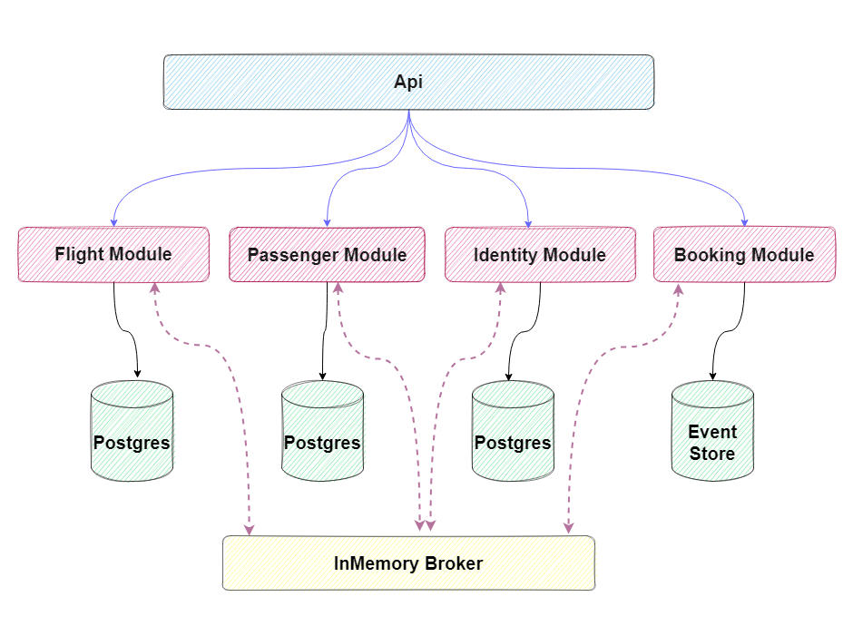

<div align="center" style="margin-bottom:20px">
  
    <div align="center">
           <a href="https://github.com/meysamhadeli/booking-modular-monolith/actions/workflows/dotnet.yml"></a>
                 <a href="https://github.com/meysamhadeli/booking-modular-monolith/blob/main/LICENSE"></a>
    </div>
</div>

> 🚀 **A practical and imaginary Modular Monolith for implementing an infrastructure for up and running Modular system with the latest technology and architecture like Vertical Slice Architecture, Event Driven Architecture, CQRS, DDD, gRpc and Cap in .Net 9.**

> 💡 **This project is not business-oriented and most of my focus was in the thechnical part for implement a Modular system with a sample project. In this project I implemented some concept in Modular Monolith like Inmemory Broker, Tracing, Event Driven Architecture, Vertical Slice Architecture, CQRS, DDD and gRpc.**

<a href="https://gitpod.io/#https://github.com/meysamhadeli/booking-modular-monolith"></a>

# Table of Contents

- [The Goals of This Project](#the-goals-of-this-project)
- [Plan](#plan)
- [Technologies - Libraries](#technologies---libraries)
- [The Domain and Bounded Context - Service Boundary](#the-domain-and-bounded-context---service-boundary)
- [Structure of Project](#structure-of-project)
- [Prerequisites](#prerequisites)
- [Development Setup](#development-setup)
  - [Dotnet Tools Packages](#dotnet-tools-packages)
- [How to Run](#how-to-run)
  - [Config Certificate](#config-certificate)
  - [Docker Compose](#docker-compose)
  - [Build](#build)
  - [Run](#run)
  - [Test](#test)
- [Documentation Apis](#documentation-apis)
- [Support](#support)
- [Contribution](#contribution)

## The Goals of This Project

- :sparkle: Using `Vertical Slice Architecture` for architecture level.
- :sparkle: Using `Domain Driven Design (DDD)` to implement all business processes in modules.
- :sparkle: Using `InMememoryBroker` on top of `Cap` for `Event Driven Architecture` between our modules.
- :sparkle: Using `Inbox Pattern` on top of `Cap` for ensuring message idempotency for receiver and `Exactly once Delivery`.
- :sparkle: Using `Outbox Pattern` on top of `Cap` for ensuring no message is lost and there is at `Least One Delivery`.
- :sparkle: Using `CQRS` implementation with `MediatR` library.
- :sparkle: Using `Postgres` for database level in our modules.
- :sparkle: Using `AspNetCore OpenApi` for `generating` built-in support `OpenAPI documentation` in ASP.NET Core.
- :sparkle: Using `Unit Testing`, `Integration Testing` for testing level.
- :sparkle: Using `Fluent Validation` and a `Validation Pipeline Behaviour` on top of `MediatR`.
- :sparkle: Using `Docker-Compose` and `Kubernetes` for our deployment mechanism.
- :sparkle: Using `OpenTelemetry` for distributed tracing.
- :sparkle: Using `IdentityServer` for implementation authentication and authorization base on `OpenID-Connect` and `OAuth2`.

## Plan

> 🌀This project is a work in progress, new features will be added over time.🌀

I will try to register future goals and additions in the [Issues](https://github.com/meysamhadeli/booking-modular-monolith/issues) section of this repository.

High-level plan is represented in the table

| Feature           | Status         |
| ----------------- | -------------- |
| API       | Completed ✔️   |
| Identity Module  | Completed ✔️   |
| Flight Module    | Completed ✔️   |
| Passenger Module | Completed ✔️   |
| Booking Module   | Completed ✔️   |
| Building Blocks   | Completed ✔️ |

## Technologies - Libraries

- ✔️ **[`.NET 9`](https://github.com/dotnet/aspnetcore)** - .NET Framework and .NET Core, including ASP.NET and ASP.NET Core.
- ✔️ **[`MVC Versioning API`](https://github.com/microsoft/aspnet-api-versioning)** - Set of libraries which add service API versioning to ASP.NET Web API, OData with ASP.NET Web API, and ASP.NET Core.
- ✔️ **[`EF Core`](https://github.com/dotnet/efcore)** - Modern object-database mapper for .NET. It supports LINQ queries, change tracking, updates, and schema migrations.
- ✔️ **[`AspNetCore OpenApi`](https://learn.microsoft.com/en-us/aspnet/core/fundamentals/openapi/aspnetcore-openapi?view=aspnetcore-9.0&tabs=visual-studio#configure-openapi-document-generation)** - Provides built-in support for OpenAPI document generation in ASP.NET Core.
- ✔️ **[`Cap`](https://github.com/dotnetcore/CAP)** - An EventBus with local persistent message functionality for system integration in SOA or Microservice architecture.
- ✔️ **[`MediatR`](https://github.com/jbogard/MediatR)** - Simple, unambitious mediator implementation in .NET.
- ✔️ **[`FluentValidation`](https://github.com/FluentValidation/FluentValidation)** - Popular .NET validation library for building strongly-typed validation rules.
- ✔️ **[`Scalar`](https://github.com/scalar/scalar/tree/main/packages/scalar.aspnetcore)** - Scalar provides an easy way to render beautiful API references based on OpenAPI/Swagger documents.
- ✔️ **[`Swagger UI`](https://github.com/domaindrivendev/Swashbuckle.AspNetCore)** - Swagger tools for documenting API's built on ASP.NET Core.
- ✔️ **[`Serilog`](https://github.com/serilog/serilog)** - Simple .NET logging with fully-structured events.
- ✔️ **[`Polly`](https://github.com/App-vNext/Polly)** - Polly is a .NET resilience and transient-fault-handling library that allows developers to express policies such as Retry, Circuit Breaker, Timeout, Bulkhead Isolation, and Fallback in a fluent and thread-safe manner.
- ✔️ **[`Scrutor`](https://github.com/khellang/Scrutor)** - Assembly scanning and decoration extensions for Microsoft.Extensions.DependencyInjection.
- ✔️ **[`Opentelemetry-dotnet`](https://github.com/open-telemetry/opentelemetry-dotnet)** - The OpenTelemetry .NET Client.
- ✔️ **[`DuendeSoftware IdentityServer`](https://github.com/DuendeSoftware/IdentityServer)** - The most flexible and standards-compliant OpenID Connect and OAuth 2.x framework for ASP.NET Core.
- ✔️ **[`EasyCaching`](https://github.com/dotnetcore/EasyCaching)** - Open source caching library that contains basic usages and some advanced usages of caching which can help us to handle caching more easier.
- ✔️ **[`Mapster`](https://github.com/MapsterMapper/Mapster)** - Convention-based object-object mapper in .NET.
- ✔️ **[`Hellang.Middleware.ProblemDetails`](https://github.com/khellang/Middleware/tree/master/src/ProblemDetails)** - A middleware for handling exception in .Net Core.
- ✔️ **[`IdGen`](https://github.com/RobThree/IdGen)** - Twitter Snowflake-alike ID generator for .Net.
- ✔️ **[`MagicOnion`](https://github.com/Cysharp/MagicOnion)** - gRPC based HTTP/2 RPC Streaming Framework for .NET, .NET Core and Unity.

## The Domain And Bounded Context - Service Boundary

- `Identity Module`: The Identity Service is a bounded context for the authentication and authorization of users using [Identity Server](https://github.com/DuendeSoftware/IdentityServer). This service is responsible for creating new users and their corresponding roles and permissions using [.Net Core Identity](https://docs.microsoft.com/en-us/aspnet/core/security/authentication/identity) and Jwt authentication and authorization.

- `Flight Module`: The Flight Service is a bounded context `CRUD` service to handle flight related operations.

- `Passenger Module`: The Passenger Service is a bounded context for managing passenger information, tracking activities and subscribing to get notification for out of stock products.

- `Booking Module`: The Booking Service is a bounded context for managing all operation related to booking ticket.

- `Api`: The Api Project use for hosting all modules in one place.

> Note: We don't have separated API project for each module because they are not microervice and shouldn't host separately, so for hosting all modules, we just use one Api project.



## Structure of Project

In this project I used a mix of [clean architecture](https://jasontaylor.dev/clean-architecture-getting-started/), [vertical slice architecture](https://jimmybogard.com/vertical-slice-architecture/) and I used [feature folder structure](http://www.kamilgrzybek.com/design/feature-folders/) to structure my files.

We have a separate module ([IdentityServer](https://github.com/DuendeSoftware/IdentityServer)) for authentication and authorization of each request. Once signed-in users are issued a JWT token. This token is used by other module to validate the user, read claims and allow access to authorized/role specific endpoints.

I used [MagicOnion](https://github.com/Cysharp/MagicOnion) for `sync` communication between our modules. This framework is based on `gRPC`, which is a fast and compact binary network transport for HTTP/2. However, unlike plain gRPC, it treats C# interfaces as a protocol schema, enabling seamless code sharing between C# projects without .proto (Protocol Buffers IDL).

I used [In-Memory Queue](https://github.com/yang-xiaodong/Savorboard.CAP.InMemoryMessageQueue) as my MessageBroker for `async` communication between modules using the eventual consistency mechanism. Each modules uses [Cap](https://github.com/dotnetcore/CAP) to interface with [In-Memory Queue](https://github.com/yang-xiaodong/Savorboard.CAP.InMemoryMessageQueue) for easy use messaging, availability, reliability, etc.

modules are `event based` which means they can publish and/or subscribe to any events occurring in the setup. By using this approach for communicating between modules, each module does not need to know about the other module or handle errors occurred in other modules.

I treat each request as a distinct use case or slice, encapsulating and grouping all concerns from front-end to back.
When adding or changing a feature in an application in n-tire architecture, we are typically touching many "layers" in an application. We are changing the user interface, adding fields to models, modifying validation, and so on. Instead of coupling across a layer, we couple vertically along a slice. We `minimize coupling` `between slices`, and `maximize coupling` `in a slice`.

With this approach, each of our vertical slices can decide for itself how to best fulfill the request. New features only add code, we're not changing shared code and worrying about side effects.

<div align="center">
  
</div>

Instead of grouping related action methods in one controller, as found in traditional ASP.net controllers, I used the [REPR pattern](https://deviq.com/design-patterns/repr-design-pattern). Each action gets its own small endpoint, consisting of a route, the action, and an `IMediator` instance (see [MediatR](https://github.com/jbogard/MediatR)). The request is passed to the `IMediator` instance, routed through a [`Mediatr pipeline`](https://lostechies.com/jimmybogard/2014/09/09/tackling-cross-cutting-concerns-with-a-mediator-pipeline/) where custom [middleware](https://github.com/jbogard/MediatR/wiki/Behaviors) can log, validate and intercept requests. The request is then handled by a request specific `IRequestHandler` which performs business logic before returning the result.

The use of the [mediator pattern](https://dotnetcoretutorials.com/2019/04/30/the-mediator-pattern-in-net-core-part-1-whats-a-mediator/) in my controllers creates clean and [thin controllers](https://codeopinion.com/thin-controllers-cqrs-mediatr/). By separating action logic into individual handlers we support the [Single Responsibility Principle](https://en.wikipedia.org/wiki/Single_responsibility_principle) and [Don't Repeat Yourself principles](https://en.wikipedia.org/wiki/Don%27t_repeat_yourself), this is because traditional controllers tend to become bloated with large action methods and several injected `Services` only being used by a few methods.

I used CQRS to decompose my features into small parts that makes our application:

- Maximize performance, scalability and simplicity.
- Easy to maintain and add features to. Changes only affect one command or query, avoiding breaking changes or creating side effects.
- It gives us better separation of concerns and cross-cutting concern (with help of mediatr behavior pipelines), instead of bloated service classes doing many things.

Using the CQRS pattern, we cut each business functionality into vertical slices, for each of these slices we group classes (see [technical folders structure](http://www.kamilgrzybek.com/design/feature-folders)) specific to that feature together (command, handlers, infrastructure, repository, controllers, etc). In our CQRS pattern each command/query handler is a separate slice. This is where you can reduce coupling between layers. Each handler can be a separated code unit, even copy/pasted. Thanks to that, we can tune down the specific method to not follow general conventions (e.g. use custom SQL query or even different storage). In a traditional layered architecture, when we change the core generic mechanism in one layer, it can impact all methods.

## Development Setup

### Dotnet Tools Packages
For installing our requirement package with .NET cli tools, we need to install `dotnet tool manifest`.
```bash
dotnet new tool-manifest
```
And after that we can restore our dotnet tools packages with .NET cli tools from `.config` folder and `dotnet-tools.json` file.
```
dotnet tool restore
```

## How to Run

### Config Certificate

Run the following commands for [Config SSL](https://docs.microsoft.com/en-us/aspnet/core/security/docker-compose-https?view=aspnetcore-6.0) in your system

```bash
dotnet dev-certs https -ep %USERPROFILE%\.aspnet\https\aspnetapp.pfx -p {password here}
dotnet dev-certs https --trust
```

> Note: for running this command in `powershell` use `$env:USERPROFILE` instead of `%USERPROFILE%`

### Docker Compose

We have a separate Docker file for setting up and running the [infrastracture.yaml](./deployments/docker-compose/infrastracture.yaml) independently.

```bash
docker-compose -f ./deployments/docker-compose/infrastracture.yaml up -d
```

TODO 👷‍♂️
Deployment App in Docker-Compose

> ### Build
To `build` all microservices, run this command in the `root` of the project:
```bash
dotnet build
```

> ### Run
To `run` each microservice, run this command in the root of the `Api` folder of each microservice where the `csproj` file is located:
```bash
dotnet run
```

> ### Test

To `test` all microservices, run this command in the `root` of the project:
```bash
dotnet test
```

> ### Documentation Apis

Each microservice provides `API documentation` and navigate to `/swagger` for `Swagger OpenAPI` or `/scalar/v1` for `Scalar OpenAPI` to visit list of endpoints.

As part of API testing, I created the [booking.rest](./booking.rest) file which can be run with the [REST Client](https://github.com/Huachao/vscode-restclient) `VSCode plugin`.

# Support

If you like my work, feel free to:

- ⭐ this repository. And we will be happy together :)

Thanks a bunch for supporting me!

## Contribution

Thanks to all [contributors](https://github.com/meysamhadeli/booking-modular-monolith/graphs/contributors), you're awesome and this wouldn't be possible without you! The goal is to build a categorized community-driven collection of very well-known resources.

Please follow this [contribution guideline](./CONTRIBUTION.md) to submit a pull request or create the issue.

## Project References & Credits

- [https://github.com/jbogard/ContosoUniversityDotNetCore-Pages](https://github.com/jbogard/ContosoUniversityDotNetCore-Pages)
- [https://github.com/kgrzybek/modular-monolith-with-ddd](https://github.com/kgrzybek/modular-monolith-with-ddd)
- [https://github.com/oskardudycz/EventSourcing.NetCore](https://github.com/oskardudycz/EventSourcing.NetCore)
- [https://github.com/thangchung/clean-architecture-dotnet](https://github.com/thangchung/clean-architecture-dotnet)
- [https://github.com/jasontaylordev/CleanArchitecture](https://github.com/jasontaylordev/CleanArchitecture)

## License
This project is made available under the MIT license. See [LICENSE](https://github.com/meysamhadeli/booking-modular-monolith/blob/main/LICENSE) for details.
